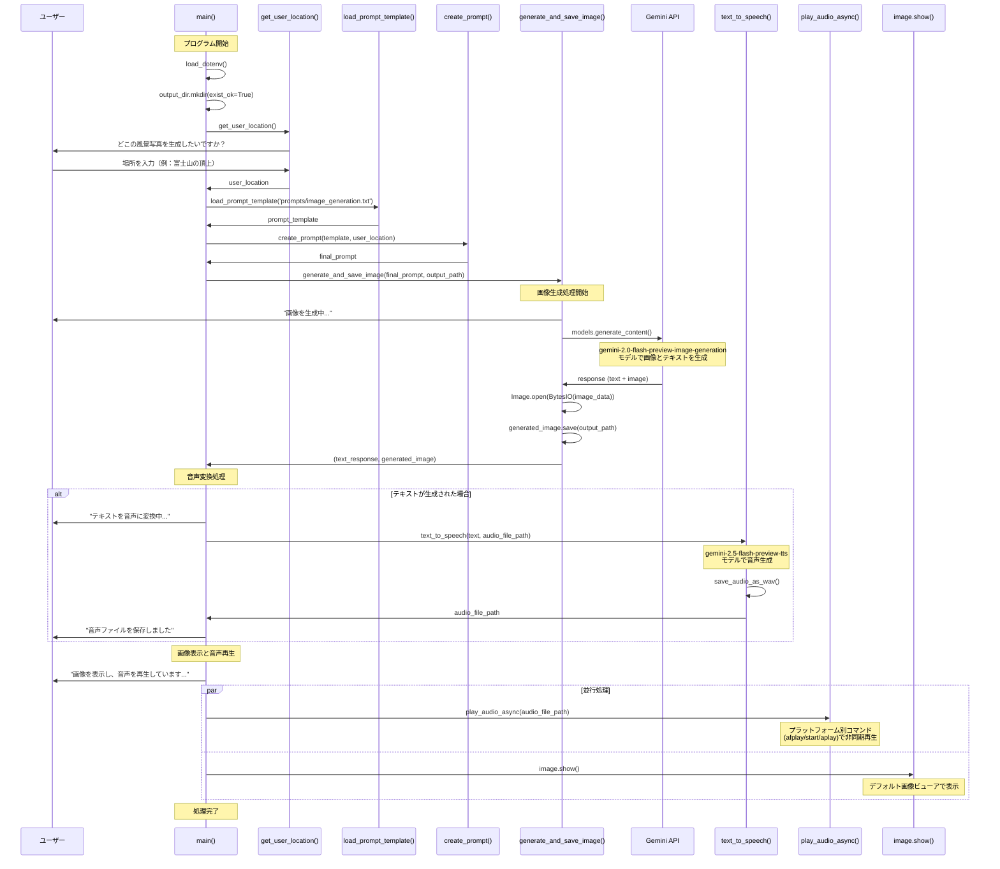

# Image Generator シーケンス図

このドキュメントは、`src/image_generator.py` の処理フローを表すシーケンス図です。

## 概要

`image_generator.py` は以下の主要な処理を行います：

1. ユーザーからの入力の受付
2. プロンプトテンプレートの読み込みと結合
3. Gemini API を使用した画像・テキスト生成
4. 生成されたテキストの音声変換
5. 画像表示と音声再生の同時実行

## シーケンス図

